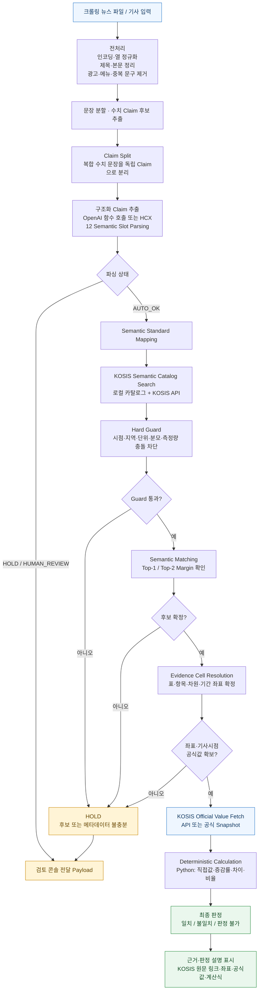

# CLAFACT-AUTO

> 뉴스 기사 속 **수치 주장(Claim)** 을 KOSIS(국가통계포털) 공식 통계와 대조하고, 근거·계산 과정·판정을 남기는 Python 기반 검증 엔진입니다.

CLAFACT-AUTO는 그럴듯한 답을 생성하는 시스템이 아닙니다. 기사 문장의 의미를 구조화한 뒤, 조건에 맞는 KOSIS 통계표와 **정확한 Evidence Cell**을 찾아 공식값을 조회하고, Python 코드로 계산하여 검증 결과를 만듭니다. 자동 판정의 근거가 부족하거나 후보가 모호하면 억지로 결론을 내리지 않고 `HOLD` 또는 `HUMAN_REVIEW`로 보냅니다.

## 공식 Claim 정의

> **CLAFACT-AUTO Claim은 뉴스 기사에 포함된 수치적 사실 주장 중, 하나의 통계지표를 대상으로 특정 시점·지역·모집단·세부 분류 등의 적용 범위와 주장값·단위·비교 기준·계산 의미를 구조화할 수 있으며, 원문 문장과 기사 기준일에 연결된 고유 정체성을 보존하고, 하나 이상의 KOSIS 공식 Evidence Cell과 하나의 결정론적 계산을 통해 하나의 최종 판정을 받을 수 있는 최소 검증 단위다. 하나의 계산과 판정으로 검증할 수 없는 서로 다른 지표·시점·지역·비교 기준·주장값은 별도 Claim으로 분리하고, 필수 정보나 공식 근거가 부족하면 임의로 확정하지 않고 사유가 명시된 HOLD로 보존한다.**

공식 원자성 규칙은 다음과 같습니다.

```text
한 Claim = 한 검증 대상 + 한 주장값 + 한 계산 의미 + 한 최종 판정
```

KOSIS Evidence Cell은 계산에 따라 하나 이상일 수 있습니다. 전년 동월 대비 증감률처럼 현재 기간과 비교 기간의 공식값이 모두 필요한 경우에도, 하나의 계산과 하나의 판정으로 귀결되면 하나의 Claim입니다. 반대로 한 문장에 서로 다른 지표·주장값·비교 기준이 포함되면 Claim Split 단계에서 각각 분리하고, 안전하게 분리할 수 없으면 `HOLD`합니다.

12개 슬롯, 출처 정체성, 분리 기준과 AUTO/HOLD 불변식은 [ClaimSchema 계약](docs/reference/03_DATA_SCHEMAS.md#claimschema)에 정의되어 있습니다.

## 왜 필요한가

뉴스 기사에는 “고용률이 62.7%”, “전년보다 3.2% 증가”, “수출이 두 배”처럼 검증 가능한 수치 주장이 포함됩니다. 하지만 같은 단어라도 연령, 지역, 단위, 시점, 계절조정 여부, 잠정/확정 여부에 따라 전혀 다른 통계가 될 수 있습니다.

예를 들어 “청년 실업률”은 다음 조건이 모두 맞아야 하나의 검증 대상이 됩니다.

- 누구의 수치인가: 청년의 연령 범위
- 무엇을 측정하는가: 실업률인지 실업자 수인지
- 어느 지역인가: 전국인지 특정 시·도인지
- 언제의 수치인가: 월·분기·연도와 기사 기준일
- 어떤 통계 조건인가: 계절조정, 원계열, 잠정/확정, 단위와 분모

CLAFACT-AUTO는 이 조건을 명시적 데이터 계약으로 보존합니다. LLM이 공식값을 만들어 내거나, 높은 의미 유사도만으로 서로 다른 통계를 같은 것으로 취급하지 않도록 설계되어 있습니다.

## 핵심 원칙

1. **KOSIS 공식값은 생성하지 않는다.** 공식값은 KOSIS API 또는 저장된 공식 Snapshot에서만 가져온다.
2. **계산은 결정론적 Python 코드가 수행한다.** 모델은 계산 결과를 추정하지 않는다.
3. **모델 출력은 Structured Output으로 제한한다.** 자유 텍스트는 내부 데이터 계약이나 판정 근거가 아니다.
4. **Hard Guard를 먼저 적용한다.** 필수 시점·지역·단위·측정량 등이 충돌하면 의미 유사도 점수를 계산하기 전에 후보를 제외한다.
5. **모호한 Top-1을 강제하지 않는다.** Top-1/Top-2 점수 차이가 작거나 근거 좌표가 불완전하면 `HOLD`한다.
6. **검증 가능한 근거를 남긴다.** 선택된 통계표, 차원 코드, 공식값 출처, 계산식, 판정 사유와 버전 정보를 결과에 기록한다.
7. **기존 CLAFACT 운영 데이터는 변경하지 않는다.** 검토가 필요한 결과는 콘솔 연동용 adapter payload로만 전달한다.

## 전체 파이프라인



전처리 단계는 기사 원문을 내부 데이터 계약으로 쓰지 않기 위해 입력 형식을 정리하고, 본문 속 광고·메뉴·중복 문구를 제거한 뒤 수치 Claim 후보 문장만 다음 단계로 전달합니다. LLM은 엄격한 데이터 계약 안에서 Claim을 구조화할 때만 사용되며, KOSIS 공식값 조회와 계산은 각각 KOSIS adapter와 Python 코드가 수행합니다.
### 구조화 Claim 추출: OpenAI / HCX

`CLAFACT_CLAIM_PROVIDER` 설정으로 추출기를 선택합니다. OpenAI는 Responses API Strict Function Calling으로 하나의 `emit_claim`만 호출하며, 기술적 실패 시 HCX 키가 설정된 경우에만 HCX 예비 처리로 전환합니다.

HCX는 기본 `responseFormat` Structured Outputs 또는 선택형 `emit_claim` Function Calling을 사용합니다. 두 방식은 같은 요청에서 함께 쓰지 않지만, 어느 Provider든 동일한 12개 Semantic Slot `ClaimSchema`를 엄격히 검증해 반환합니다.

KOSIS 검색, Hard Guard, Semantic Matching, Evidence Cell Resolution, 공식값 조회, 계산, 최종 판정은 어떤 Provider에도 노출되지 않으며 계속 Python 파이프라인이 직접 통제합니다.

- [HCX Structured Outputs 공식 문서](https://api.ncloud-docs.com/docs/clovastudio-chatcompletionsv3-so)
- [HCX Function Calling 공식 문서](https://api.ncloud-docs.com/docs/clovastudio-chatcompletionsv3-fc)

```text
Article
  → Claim Extraction
  → Claim Split
  → 12 Semantic Slot Parsing
  → Semantic Standard Mapping
  → KOSIS Semantic Catalog Search
  → Hard Guard
  → Semantic Matching
  → Match Candidate
  → Evidence Cell Resolution
  → KOSIS Official Value Fetch
  → Deterministic Calculation
  → Verdict
```

각 단계의 역할은 다음과 같습니다.

| 단계 | 하는 일 | 자동 진행을 멈추는 대표 사례 |
| --- | --- | --- |
| Claim Extraction / Split | 기사에서 수치 주장을 추출하고 복합 문장을 독립 Claim으로 분리 | 수치 간 관계를 분명히 나눌 수 없음 |
| 12 Slot Parsing | 측정 대상, 측정량, 시간, 지역, 단위, 비교 기준 등 의미를 구조화 | 필수 슬롯이 비어 있거나 해석이 둘 이상 |
| Semantic Mapping / Catalog Search | 표준 개념과 KOSIS 후보 통계표를 탐색 | 표준 개념 또는 후보를 찾지 못함 |
| Hard Guard | 시간·지역·단위·분모·계절조정·측정량 충돌을 선제적으로 제거 | 구조적 불일치 |
| Semantic Matching | 남은 후보의 적합도를 비교하고 Top-1/Top-2 margin을 확인 | 후보 간 점수 차이가 임계값 미만 |
| Evidence Cell Resolution | 선택 표의 행·열·분류 차원 코드로 공식 통계 셀을 확정 | 코드/좌표가 불완전하거나 다의적 |
| Value Fetch / Calculation | KOSIS API 또는 immutable snapshot에서 값을 읽고 계산 | 기사 시점의 공식값 부재, API 오류, 계산 불가 |
| Verdict | 기사 수치와 공식 근거를 비교해 결과와 사유를 생성 | 근거 불충분 시 `HOLD` 또는 `HUMAN_REVIEW` |

## 12 Semantic Slots

Claim은 자연어 문장 자체가 아니라 아래 슬롯을 갖는 `ClaimSchema`로 처리됩니다. 이 구조는 검색, Guard, 증거 좌표 해석, 계산을 연결하는 내부 계약입니다.

`claim_id`, `source_sentence`, `parse_status`, `parse_reason`은 추적·라우팅을 위한 메타데이터이며, 아래 12개가 의미 해석에 사용하는 슬롯입니다.

| 슬롯 | 의미 | 예시 |
| --- | --- | --- |
| `indicator` | 검증할 지표·항목 | 고용률, 배추 물가, 수출액 |
| `value` | 기사에 제시된 수치 | 62.7 |
| `unit` | 단위 | %, 명, 억 원 |
| `time` | 기준 시점·기간 | 2025년 7월, 2분기 |
| `frequency` | 통계 주기 | 월, 분기, 연 |
| `region` | 공간 범위 | 전국, 서울특별시 |
| `population` | 대상 집단·모집단 | 15~29세 청년, 제조업 취업자 |
| `dimension` | KOSIS 분류 차원·조건 | 성별, 연령, 산업, 품목 |
| `comparison` | 비교 기준 | 전년 동월 대비, 전월 대비 |
| `calculation` | 필요한 계산 유형 | DIRECT_VALUE, GROWTH_RATE, DIFFERENCE, RATIO |
| `condition` | 계절조정·잠정/확정 등 통계 조건 | 계절조정, 원계열, 잠정 |
| `source_hint` | 기사 속 출처·통계 범위 단서 | KOSIS, 국가승인통계 |

실제 스키마와 세부 계약은 [docs/reference/03_DATA_SCHEMAS.md](docs/reference/03_DATA_SCHEMAS.md)에 정리되어 있습니다.

## 판정과 라우팅

CLAFACT-AUTO는 “참/거짓” 두 가지로만 처리하지 않습니다. 처리 경로와 함께 공식 근거 기반의 3분류 최종 결론을 기록합니다.

| Route | 의미 | 예시 |
| --- | --- | --- |
| `AUTO` | 공식 근거 좌표와 계산이 충분히 확정된 자동 처리 경로 | 기사값 62.7%, KOSIS 셀 62.7%, 직접값 검증 완료 |
| `HOLD` | 자동 결론을 내릴 근거가 부족하거나 후보가 모호한 상태 | 기사 기준일 없음, Top-1/Top-2 margin 부족, 스냅샷 없음 |
| `HUMAN_REVIEW` | 사람이 문맥 또는 해석을 검토해야 하는 상태 | 복수 해석 가능, parser/provider가 검토 필요로 표시 |

최종 Verdict는 공식값과 Python 계산 결과를 비교한 `MATCH`(일치), `MISMATCH`(불일치), `UNDETERMINED`(판정 불가) 중 하나입니다. `HOLD` 또는 `HUMAN_REVIEW`는 근거 부족 또는 문맥 검토 필요를 뜻하는 처리 경로입니다.


| Verdict | 사용자 화면 표시 | 의미 |
| --- | --- | --- |
| `MATCH` | 일치 | 기사값과 KOSIS 공식 근거 계산값의 차이가 허용 오차 이내 |
| `MISMATCH` | 불일치 | 기사값과 KOSIS 공식 근거 계산값의 차이가 허용 오차를 초과 |
| `UNDETERMINED` | 판정 불가 | 공식 근거·좌표·기사 시점·후보 조건이 부족해 자동 판정을 확정할 수 없음 |

최종 판정 아래에는 자연어 설명을 표시합니다. OpenAI가 설정되어도 AI는 확정된 결론을 설명할 뿐 공식값, 계산값, 근거 좌표, 최종 판정을 변경할 수 없습니다. 설명 호출이 실패하면 동일한 결론을 설명하는 규칙 기반 문구를 표시합니다.

## 계산 엔진

계산 엔진은 `core/calculator.py`의 Python 함수로만 수행됩니다. 현재 다음 계산 유형을 지원합니다.

- `DIRECT_VALUE`: 기사 수치와 하나의 공식 셀 값을 비교
- `GROWTH_RATE`: 기준값과 비교값으로 증감률 계산
- `DIFFERENCE`: 두 공식값의 차이 계산
- `RATIO`: 분자/분모 비율 계산
- `RANK`, `SHARE`, `THRESHOLD`, `MULTIPLE`: 순위·점유율·임계값·배수 유형

모든 계산 결과에는 계산 버전과 입력 Evidence가 함께 기록되어 재현할 수 있습니다.

## 프로젝트 구조

```text
clafact-auto/
├─ app/
│  └─ streamlit_app.py       # Streamlit MVP
├─ core/                     # 검증 파이프라인의 순수 도메인 로직
├─ schemas/                  # Pydantic v2 데이터 계약
├─ data/
│  ├─ semantic_standard/     # 표준 개념 데이터
│  ├─ kosis_catalog/         # KOSIS 메타데이터·후보 카탈로그
│  └─ kosis_snapshots/       # 수정하지 않는 공식 근거 snapshot
├─ config/                   # 환경 설정과 안전한 로깅
├─ tests/
│  ├─ unit/                  # 핵심 함수 단위 테스트
│  ├─ integration/           # 모듈 연결 테스트
│  └─ goldset/               # Goldset 기반 회귀 검증
├─ docs/reference/           # 요구사항·설계·운영 상세 문서
├─ logs/                     # 런타임 로그(커밋 제외)
├─ AGENTS.md                 # 구현 규칙
├─ README.md                 # 이 프로젝트 안내서
└─ pyproject.toml
```

## 빠른 시작

### 1. 요구 환경

- Python 3.12 이상
- KOSIS OpenAPI Key (API 조회를 사용할 경우)
- HCX API Key (Structured Output 기반 Parser를 사용할 경우)
- OpenAI API Key (OpenAI Function Calling 추출과 AI 판정 설명을 사용할 경우)

API 키는 파일에 하드코딩하거나 로그에 남기지 않습니다. 프로젝트 루트의 `.env`에만 넣고, `.env`는 Git으로 추적하지 않습니다.

```ini
# .env
KOSIS_API_KEY=your_kosis_api_key
HCX_API_KEY=your_hcx_api_key
CLAFACT_LOG_LEVEL=INFO
OPENAI_API_KEY=your_openai_api_key
CLAFACT_CLAIM_PROVIDER=openai
CLAFACT_OPENAI_MODEL=gpt-5.6-luna
CLAFACT_LLM_VERDICT_EXPLANATION_ENABLED=true
```

`CLAFACT_CLAIM_PROVIDER`는 `openai` 또는 `hcx`를 사용합니다. `openai`를 선택하면 OpenAI가 Claim을 구조화하고, 기술적 실패 시 HCX 키가 설정된 경우에만 HCX 예비 처리로 전환합니다. `CLAFACT_LLM_VERDICT_EXPLANATION_ENABLED=true`이면 이미 Python/KOSIS로 확정된 결론을 AI가 설명하며, 실패 시 규칙 기반 설명으로 자동 전환합니다. `CLAFACT_LOG_LEVEL=INFO`는 일반적인 운영 로그 수준입니다. 디버깅 시 `DEBUG`로 바꿀 수 있지만, 어떤 수준에서도 API 키는 기록하지 않아야 합니다.

### 2. 설치

```powershell
python -m pip install -e ".[dev,app]"
```

최소 엔진만 설치하려면 다음을 사용합니다.

```powershell
python -m pip install -e ".[dev]"
```

### 3. 테스트

```powershell
python -m pytest -q
```

테스트는 Claim 분리·파싱 상태·Hard Guard 우선순위·후보 margin 처리·Evidence 좌표·KOSIS Snapshot/API adapter·계산·Verdict·Goldset 경로를 다룹니다.

### 4. Streamlit MVP 실행

```powershell
streamlit run app/streamlit_app.py
```

화면에서 기사 문장과 기사 날짜(`YYYY-MM-DD`)를 입력하면 다음을 확인할 수 있습니다.

- 구조화된 Claim과 `parse_status`
- 후보 통계표와 Guard/Matching 결과
- 선택된 Evidence 좌표와 공식값 조회 상태
- 결정론적 계산 결과와 Verdict
- `HOLD`/`HUMAN_REVIEW` 결과를 기존 검증 콘솔로 넘길 수 있는 adapter payload

- OpenAI/HCX 연결 상태와 실제 주장 추출기
- `일치`·`불일치`·`판정 불가` 3분류 결론 및 안전한 자연어 설명
- KOSIS 공식 근거 표·원문 링크·3갈래 실행 추적
- CSV/XLSX/JSON 크롤링 뉴스 배치 검증과 결과 XLSX 다운로드

## KOSIS 공식값과 Snapshot 정책

공식값 조회는 두 가지 adapter를 통해 이뤄집니다.

1. **KOSIS API**: 코드가 확정된 Evidence Cell의 값만 요청한다.
2. **공식 Snapshot**: 저장된 KOSIS 응답 또는 검증 시점의 공식 근거를 읽는다.

Snapshot은 `data/kosis_snapshots/` 아래 JSON으로 보관하며, 요청 파라미터·조회 시각·응답 SHA-256 해시를 기록합니다. 기존 Snapshot을 덮어쓰지 않고 새 버전을 추가합니다. 이는 기사 시점의 공표값과 나중에 갱신된 통계값을 구분하기 위해서입니다.

## 운영 안전장치

- API 키는 환경변수 또는 `.env`에서만 읽습니다.
- 로그는 키를 마스킹하며 로테이션합니다.
- 네트워크 접근은 adapter 계층에 분리되어 있습니다.
- 실제 운영 데이터에 직접 쓰지 않습니다.
- 확인 불가능한 과거 공표값, 불명확한 차원 코드, 갱신 시점 충돌은 자동 통과하지 않습니다.
- `HOLD` 결과는 검토 콘솔로 전달할 수 있도록 독립 adapter interface를 제공합니다.
- 결과에는 `dataset_version`, `preprocess_version`, `claim_schema_version`, `semantic_standard_version`, `kosis_catalog_version`, `matching_version`, `calculation_version`을 기록합니다.

## 상세 문서

설계와 운영 기준은 루트가 아니라 `docs/reference/`에서 관리합니다.

| 문서 | 내용 |
| --- | --- |
| [00_README.md](docs/reference/00_README.md) | 구현 문서 묶음의 목적과 구성 |
| [01_PRODUCT_REQUIREMENTS.md](docs/reference/01_PRODUCT_REQUIREMENTS.md) | 제품 요구사항 |
| [02_SYSTEM_ARCHITECTURE.md](docs/reference/02_SYSTEM_ARCHITECTURE.md) | 시스템 아키텍처 |
| [03_DATA_SCHEMAS.md](docs/reference/03_DATA_SCHEMAS.md) | 데이터 스키마 |
| [04_FUNCTION_SPECS.md](docs/reference/04_FUNCTION_SPECS.md) | 핵심 함수 명세 |
| [05_KOSIS_INTEGRATION.md](docs/reference/05_KOSIS_INTEGRATION.md) | KOSIS 연동 기준 |
| [06_TEST_AND_GOLDSET.md](docs/reference/06_TEST_AND_GOLDSET.md) | 테스트와 Goldset 기준 |
| [07_UI_SPEC.md](docs/reference/07_UI_SPEC.md) | Streamlit MVP UI 명세 |
| [08_IMPLEMENTATION_ROADMAP.md](docs/reference/08_IMPLEMENTATION_ROADMAP.md) | 구현 로드맵 |
| [RUNBOOK.md](docs/reference/RUNBOOK.md) | 설치·실행·운영 절차 |

## 개발 원칙

변경을 만들 때는 루트 [AGENTS.md](AGENTS.md)를 반드시 따릅니다. 특히 다음은 변경 불가 원칙입니다.

- 공식 통계값을 언어 모델의 추정으로 채우지 않는다.
- Hard Guard를 의미 유사도보다 먼저 실행한다.
- 불확실성을 자동 정답처럼 처리하지 않는다.
- 새로운 핵심 로직에는 pytest를 추가한다.
- 외부 API는 adapter를 통해서만 호출하고, 비밀값을 코드나 로그에 남기지 않는다.

---

CLAFACT-AUTO는 자동화율보다 **근거가 있는 자동화**를 우선합니다. 자동으로 판단할 수 없는 경우를 정확히 멈추고 사람이 검토할 수 있게 만드는 것이 검증 엔진의 핵심 기능입니다.
